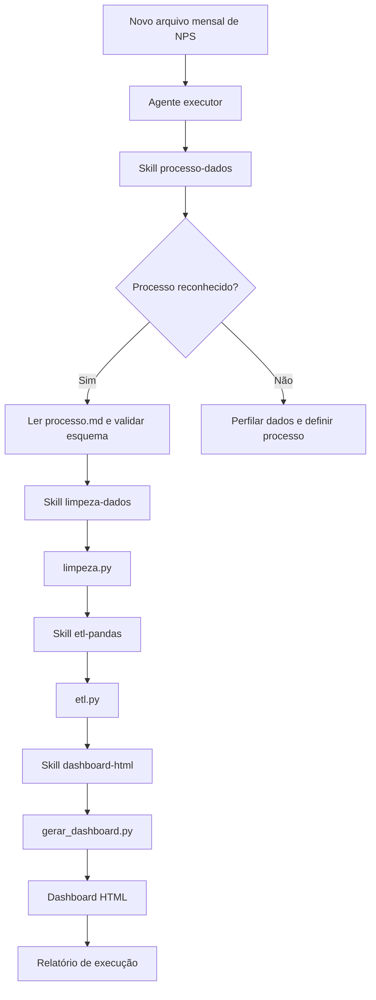

# AI Data Analyst Agent

Agente de IA para automatizar um processo de análise de dados de ponta a ponta: validação da base, limpeza, consolidação, cálculo de indicadores e geração de um dashboard executivo.

Neste projeto, o agente atua sobre um caso de uso recorrente de análise de NPS de e-commerce. A execução é orientada por skills especializadas, scripts Python versionados e regras de negócio registradas em um processo reutilizável.

## Demonstração

### Dashboard interativo

> Substitua `SEU-USUARIO` pelo seu usuário do GitHub e ajuste `AI-Gen-Labs/ai-assistant-data-analyst` caso a estrutura final do repositório seja diferente.

[Abrir dashboard NPS no GitHub Pages](https://SEU-USUARIO.github.io/AI-Gen-Labs/ai-assistant-data-analyst/dashboards/dashboard_nps_ecommerce.html)

### Artefatos do projeto

- [Dashboard NPS em HTML](dashboards/dashboard_nps_ecommerce.html)
- [Dashboard de pesquisa de satisfação em HTML](dashboards/dashboard_pesquisa_satisfacao_clientes.html)
- [Processo documentado de NPS](processos/nps_ecommerce/processo.md)
- [Agente executor](.agents/agents/executor-processo-dados.md)

## Problema

Lideranças frequentemente recebem arquivos de pesquisa em diferentes períodos e precisam transformá-los em informações confiáveis para tomada de decisão.

Sem um processo padronizado, a rotina envolve manualmente:

1. Receber os arquivos;
2. Conferir colunas e qualidade dos dados;
3. Corrigir formatos e inconsistências;
4. Consolidar o histórico;
5. Calcular indicadores;
6. Atualizar gráficos e relatórios;
7. Comunicar os principais insights.

O objetivo deste projeto é delegar esse fluxo a um agente de IA que executa um processo previamente definido, com validações, rastreabilidade e regras de tratamento documentadas.

## Solução

O agente não realiza uma análise livre ou altera regras silenciosamente. Ele utiliza a skill `processo-dados` para reconhecer ou organizar o processo e, quando o processo já existe, executa as etapas documentadas na ordem definida.



## Arquitetura do agente

### Agente executor: `executor-processo-dados`

O agente executor é responsável por conduzir a execução de um processo de dados já registrado:

1. Lê o `processo.md`, que funciona como fonte de verdade;
2. Valida o arquivo de entrada contra o esquema esperado;
3. Preserva o arquivo original em `dados_brutos/`;
4. Executa as etapas do pipeline;
5. Confere se as saídas foram geradas corretamente;
6. Compara os resultados com o histórico de execuções;
7. Atualiza o histórico e retorna um relatório de status.

Em caso de colunas faltantes, colunas novas ou tipos incompatíveis, o agente interrompe o processo e solicita revisão, em vez de improvisar uma nova regra de negócio.

[Consultar instruções do agente executor](.agents/agents/executor-processo-dados.md)

### Skill `processo-dados`

Funciona como camada de orquestração. Ela decide se o dataset corresponde a um processo conhecido, diferencia uma análise pontual de um processo recorrente e coordena as skills especializadas.

[Consultar skill processo-dados](.agents/skills/processo-dados/SKILL.md)

### Skill `limpeza-dados`

Define as regras para diagnosticar e tratar a qualidade dos dados antes da análise:

- Validação das colunas obrigatórias;
- Remoção de duplicatas exatas;
- Conversão de datas;
- Conversão de notas NPS para o intervalo esperado;
- Conversão de valores monetários;
- Padronização de categorias, canais e dispositivos;
- Validação da base resultante.

[Consultar skill limpeza-dados](.agents/skills/limpeza-dados/SKILL.md)

### Skill `etl-pandas`

Define a separação entre extração, transformação, validação e carregamento. Neste projeto, ela orienta a leitura dos arquivos mensais, a consolidação histórica e a geração de uma base tratada para consumo do dashboard.

[Consultar skill etl-pandas](.agents/skills/etl-pandas/SKILL.md)

### Skill `dashboard-html`

Transforma os dados tratados em um dashboard HTML com KPIs, gráficos por segmento e observações metodológicas. Os dados são pré-agregados em Python e incorporados ao HTML gerado.

[Consultar skill dashboard-html](.agents/skills/dashboard-html/SKILL.md)

## Obsidian como segundo cérebro

O projeto também utiliza o Obsidian como uma camada de memória e organização do conhecimento. Ele funciona como um segundo cérebro para registrar contexto, decisões, instruções e relações entre o agente, as skills e os processos de dados.

Essa camada é complementar ao código:

- o agente executa o processo;
- as skills definem como cada etapa deve ser conduzida;
- os scripts implementam as transformações;
- o `processo.md` registra o contrato operacional do dataset;
- o Obsidian organiza o conhecimento, o contexto e a memória de trabalho do projeto.

O vault do Obsidian é versionado junto com a configuração necessária para reproduzir essa organização. A pasta [`.obsidian/`](.obsidian/) contém as configurações do vault e os plugins utilizados, incluindo o `Folder Bridge`, usado para conectar pastas externas ao ambiente de conhecimento.

O `processo.md` representa a memória operacional do pipeline: nele ficam o esquema esperado, a frequência de entrada, as decisões de tratamento, os comandos de execução e o histórico das execuções. Dessa forma, o agente não depende apenas de contexto informal para repetir a análise.

```text
Obsidian / memória do projeto
            ↓
Contexto, decisões e documentação
            ↓
Skills especializadas
            ↓
Agente executor
            ↓
Scripts e artefatos analíticos
```

Essa arquitetura separa memória, orquestração e execução, tornando o processo mais compreensível, auditável e reutilizável.

## Caso de uso: NPS de e-commerce

O processo reconhece arquivos mensais no padrão:

```text
nps_ecommerce_YYYY-MM.csv
```

O fluxo executado é:

```text
Arquivo mensal bruto
    ↓
Validação do esquema
    ↓
Limpeza e padronização
    ↓
Validação do mês de referência
    ↓
Consolidação histórica
    ↓
Cálculo do NPS e segmentações
    ↓
Geração do dashboard executivo
```

### Regras de tratamento

- Os arquivos brutos permanecem preservados;
- Duplicatas exatas são removidas;
- Datas são padronizadas no formato ISO;
- Notas NPS são validadas entre 0 e 10;
- Valores como `R$ 128,15` são convertidos para números decimais;
- Dispositivos ausentes recebem `Nao informado`;
- `primeiro_pedido` é normalizado para `Sim` ou `Nao`;
- O mês do nome do arquivo é validado contra as datas internas;
- O pipeline falha quando a estrutura recebida não corresponde ao contrato esperado.

## Scripts do processo

| Arquivo | Responsabilidade |
| --- | --- |
| [`processo.md`](processos/nps_ecommerce/processo.md) | Esquema, decisões de negócio, comandos e histórico de execuções |
| [`limpeza.py`](processos/nps_ecommerce/limpeza.py) | Limpeza, padronização e validação de cada arquivo mensal |
| [`etl.py`](processos/nps_ecommerce/etl.py) | Descoberta, leitura e consolidação dos arquivos mensais |
| [`gerar_dashboard.py`](processos/nps_ecommerce/gerar_dashboard.py) | Cálculo das métricas e geração do dashboard HTML |

## Resultados da execução demonstrativa

A execução registrada no projeto consolidou 2.414 respostas de NPS entre abril e junho de 2026.

| Período | Respostas | NPS | Nota média | Ticket médio |
| --- | ---: | ---: | ---: | ---: |
| Abril/2026 | 780 | 16,2 | 7,78 | R$ 160,25 |
| Maio/2026 | 815 | -5,0 | 7,27 | R$ 151,50 |
| Junho/2026 | 819 | -7,2 | 7,26 | R$ 145,40 |

### Leituras por segmento

- O marketplace apresentou o melhor NPS entre os canais no mês mais recente: `-3,9`;
- O site apresentou o menor NPS entre os canais: `-8,8`;
- A categoria Esporte teve o melhor resultado: `3,7`;
- A categoria Mercado teve o menor resultado: `-17,1`;
- O dispositivo iOS apresentou NPS de `-13,0` no mês mais recente;
- Clientes de primeiro pedido e clientes recorrentes apresentaram resultados próximos, com NPS de `-7,4` e `-7,0`, respectivamente.

Esses resultados representam a execução demonstrativa sobre os dados versionados no projeto. Não são apresentados como indicadores oficiais de uma operação empresarial real.

## Segundo fluxo: pesquisa de satisfação

O projeto também contém uma análise pontual de pesquisa de satisfação de clientes. Esse fluxo demonstra que o agente pode tratar uma necessidade específica sem necessariamente transformá-la em um processo recorrente.

Resultados do artefato disponível:

- 420 respostas recebidas;
- 12 duplicatas exatas removidas;
- 400 respostas válidas para o cálculo de CSAT;
- CSAT de `65%`;
- Taxa de recomendação de `45%`;
- `55,2%` dos registros com comentários negativos;
- Chat com melhor CSAT: `70%`;
- E-mail com menor CSAT: `62,5%`.

[Abrir dashboard de pesquisa de satisfação](dashboards/dashboard_pesquisa_satisfacao_clientes.html)

## Como executar

### Consolidar os arquivos mensais

```powershell
python processos/nps_ecommerce/etl.py `
  --input-dir dados_brutos `
  --output-csv dados_tratados/nps_ecommerce_tratado.csv
```

### Gerar o dashboard

```powershell
python processos/nps_ecommerce/gerar_dashboard.py `
  --input-csv dados_tratados/nps_ecommerce_tratado.csv `
  --output-html dashboards/dashboard_nps_ecommerce.html
```

O processo completo e as decisões registradas estão documentados em [`processo.md`](processos/nps_ecommerce/processo.md).

## Estrutura do projeto

```text
.
├── .obsidian/
│   ├── app.json
│   ├── workspace.json
│   └── plugins/
│       └── folderbridge/
├── .agents/
│   ├── agents/
│   │   └── executor-processo-dados.md
│   └── skills/
│       ├── processo-dados/
│       ├── limpeza-dados/
│       ├── etl-pandas/
│       └── dashboard-html/
├── dados_brutos/
├── dados_tratados/
├── dashboards/
├── processos/
│   └── nps_ecommerce/
│       ├── processo.md
│       ├── limpeza.py
│       ├── etl.py
│       └── gerar_dashboard.py
└── processar_pesquisa_satisfacao_clientes.py
```

## Tecnologias

- Agentes de IA e skills especializadas;
- Python;
- pandas;
- ETL;
- HTML, CSS e JavaScript;
- Chart.js;
- GitHub Pages;
- PowerShell.

## Escopo e limitações

- A classificação dos comentários da pesquisa de satisfação utiliza regras heurísticas de texto;
- Os dados disponíveis servem para demonstrar o fluxo do agente;
- O agente executa processos previamente definidos; mudanças nas regras de negócio exigem revisão humana;
- O dashboard utiliza o Chart.js via CDN e precisa de conexão com a internet para carregar os gráficos;
- O projeto demonstra automação de processo e geração de relatório, mas não representa uma implantação produtiva com agendamento, banco de dados ou monitoramento de infraestrutura.

## O que este projeto demonstra

Este projeto demonstra como um agente de IA pode assumir a execução operacional de um processo de análise de dados, mantendo a separação entre:

- interpretação do processo;
- regras de qualidade;
- transformação dos dados;
- cálculo das métricas;
- geração do relatório;
- validação e comunicação do resultado.

O diferencial não está apenas na geração de um dashboard, mas na criação de um fluxo reutilizável no qual o agente coordena skills, executa scripts versionados, aplica regras documentadas e entrega um resultado analítico reproduzível.

## Links para configurar após publicar o GitHub Pages

Depois de configurar o GitHub Pages do repositório maior, substitua os placeholders abaixo pelos links reais:

```markdown
[Dashboard NPS interativo](https://SEU-USUARIO.github.io/AI-Gen-Labs/ai-assistant-data-analyst/dashboards/dashboard_nps_ecommerce.html)

[Dashboard CSAT interativo](https://SEU-USUARIO.github.io/AI-Gen-Labs/ai-assistant-data-analyst/dashboards/dashboard_pesquisa_satisfacao_clientes.html)
```
